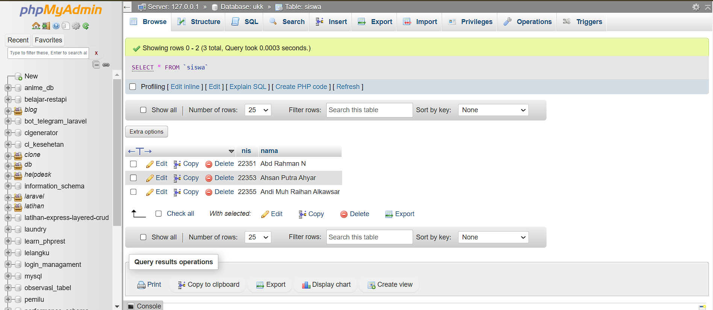
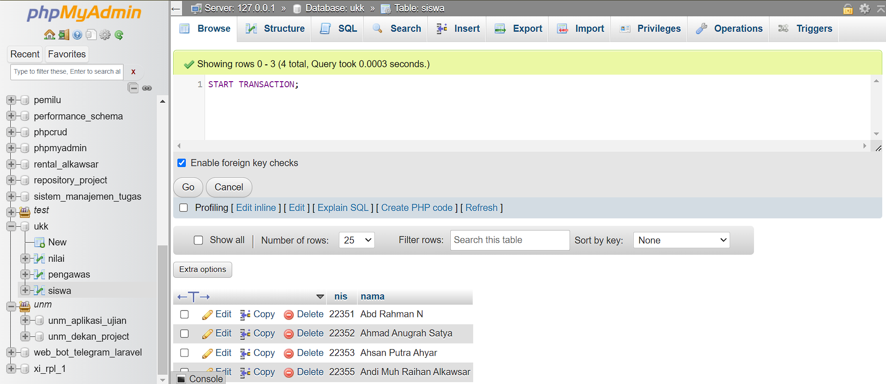
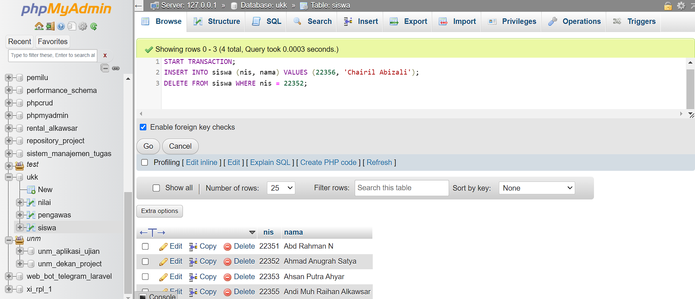
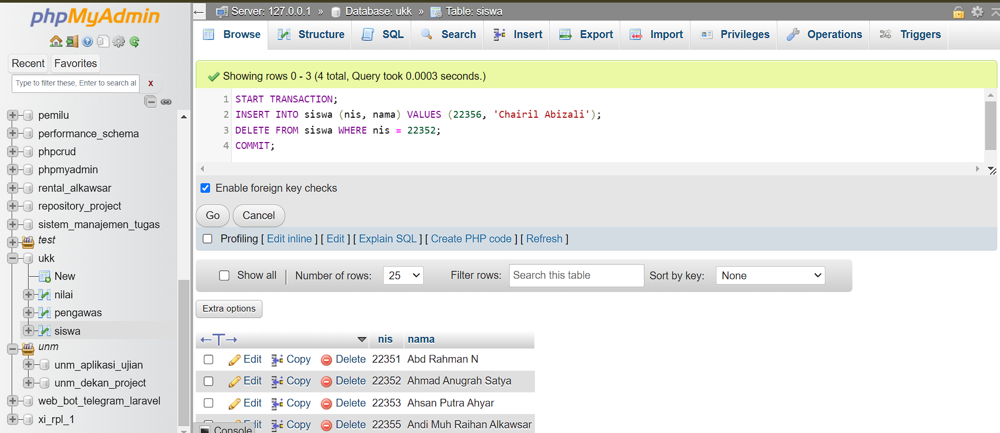
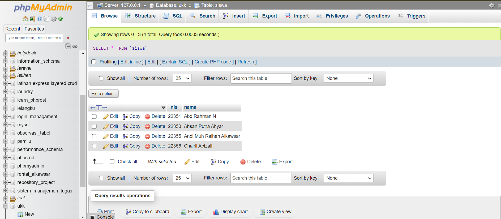
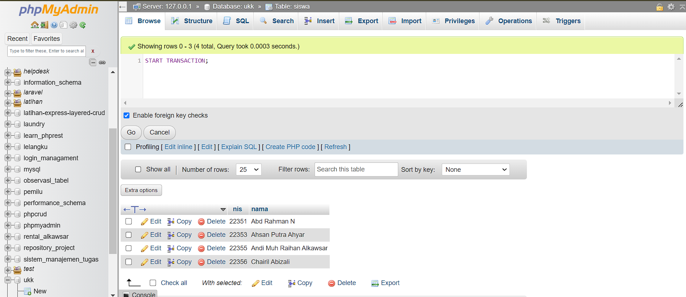
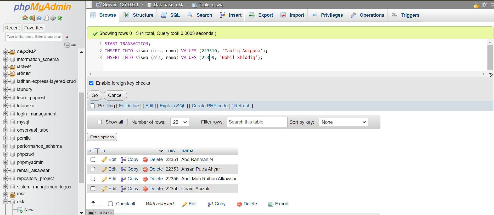
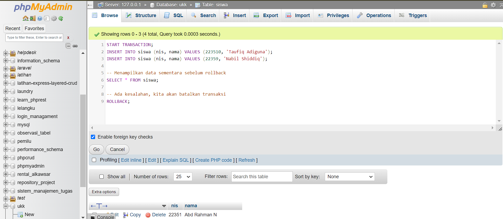
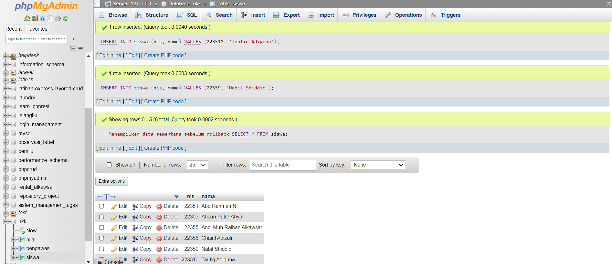

# Commit dan Rollback

- ==`COMMIT`== : Menyimpan transaksi secara permanen
- ==`ROLLBACK`== : Mengembalikan database ke bentuk awal / COMMIT terakhir

Penting untuk dicatat bahwa transaksi harus dimulai dengan perintah `START TRANSACTION`, kemudian diikuti dengan serangkaian perubahan data, dan diakhiri dengan `COMMIT` jika transaksi berhasil atau `ROLLBACK` jika transaksi perlu dibatalkan. Dengan menggunakan commit dan rollback, Anda dapat memastikan konsistensi data dan meminimalkan risiko kehilangan data atau kondisi anomali lainnya dalam database Anda.

## Cara Menggunakan Perintah COMMIT MySQL

1. Pertama, untuk melakukan query di phpmyadmin ada banyak cara, disini saya mencontohkan salah satunya.
2. Pada contoh commit ini, disini kita akan melakukan query di tabel `siswa`, maka kita perlu ke halaman tabel `siswa` terlebih dahulu.
3. Kemudian terdapat tombol `Edit` dan `Edit inline` Anda dapat memilih salah satunya.
   
4. Untuk melakukan perintah COMMIT, Pertama Mulai transaksi, gunakan perintah `START TRANSACTION` untuk memulai transaksi baru.

```mysql
START TRANSACTION;
```



5. Selanjutnya, jalankan perintah-perintah SQL seperti `INSERT`, `UPDATE`, atau `DELETE` yang ingin Anda lakukan di dalam transaksi.

```mysql
INSERT INTO siswa (nis, nama) VALUES (22356, 'Chairil Abizali');
DELETE FROM siswa WHERE nis = 22352;
```

 6. Selama proses transaksi, perhatikan kondisi-kondisi yang mungkin memerlukan penyimpanan perubahan ke database. 7. Kemudian, simpan perubahan dengan COMMIT, Jika semua perintah dalam transaksi berhasil dieksekusi dan tidak ada masalah, gunakan perintah `COMMIT` untuk menyimpan perubahan ke database. 8. Pastikan untuk menekan tombol `'Go'` setelah selesai menuliskan querynya.

```mysql
COMMIT;
```



## Cara Menggunakan Perintah ROLLBACK MySQL

1. Pertama, untuk melakukan query di phpmyadmin ada banyak cara, disini saya mencontohkan salah satunya.
2. Pada contoh rollback ini, disini kita akan melakukan query di tabel `siswa`, maka kita perlu ke halaman tabel `siswa` terlebih dahulu.
3. Kemudian terdapat tombol `Edit` dan `Edit inline` Anda dapat memilih salah satunya.
   
4. Sama seperti perintah COMMIT, Untuk melakukan perintah ROLLBACK, Pertama Mulai transaksi, gunakan perintah `START TRANSACTION` untuk memulai transaksi baru.

```mysql
START TRANSACTION;
```

 5. Selanjutnya, jalankan perintah-perintah SQL seperti `INSERT`, `UPDATE`, atau `DELETE` yang ingin Anda lakukan di dalam transaksi.

```mysql
-- Menambahkan data siswa baru
INSERT INTO siswa (nis, nama) VALUES (223510, 'Taufiq Adiguna');
INSERT INTO siswa (nis, nama) VALUES (22359, 'Nabil Shiddiq');
```

 6. Selama proses transaksi, perhatikan kondisi-kondisi yang mungkin memerlukan pembatalan transaksi, seperti kesalahan atau situasi yang tidak diinginkan. 7. Jika terjadi kesalahan atau Anda ingin membatalkan transaksi, gunakan perintah `ROLLBACK`. Ini akan membatalkan semua perubahan yang dilakukan sejak transaksi dimulai.

```mysql
ROLLBACK;
```

 8. Pastikan untuk menekan tombol `'Go'` setelah selesai menuliskan querynya.

